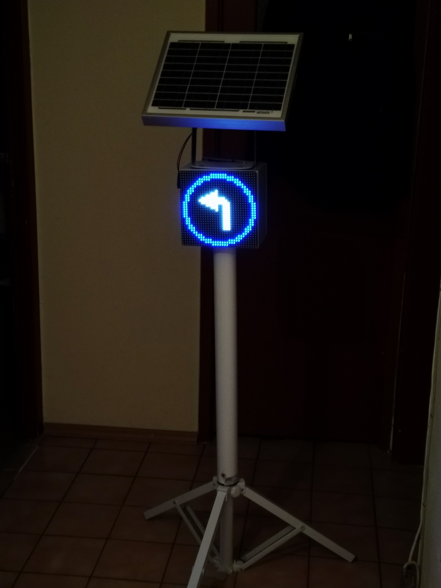
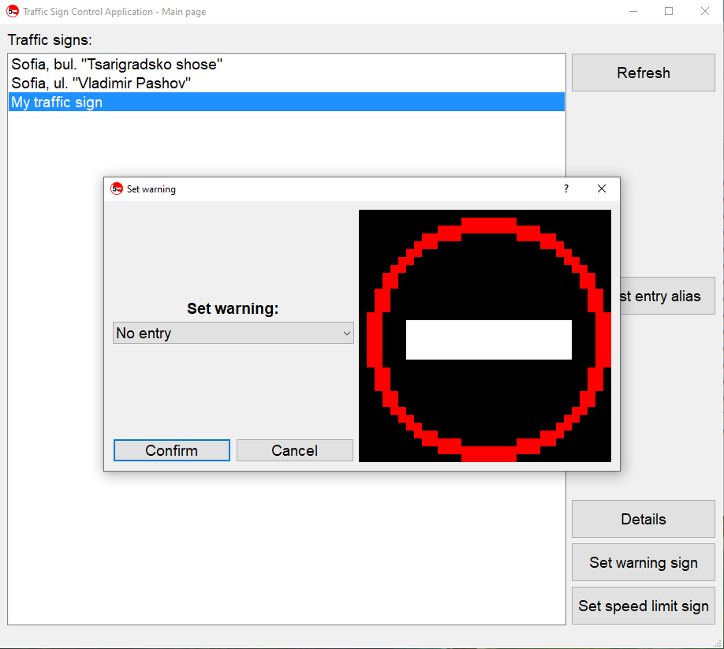
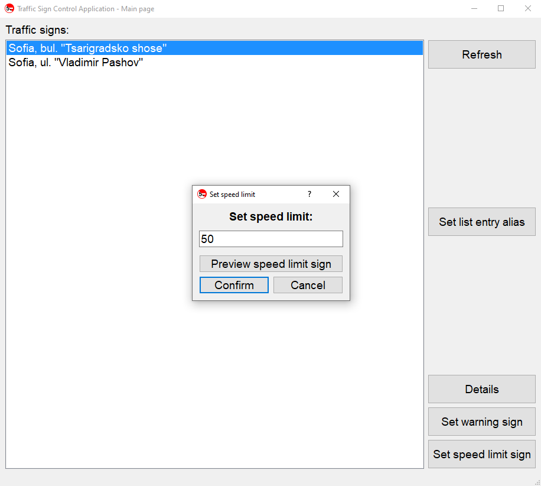

 <h1 align="center">Пътен знак с дистанционно управление  
 Adjustable traffic sign</h1>

## [Документация](./Documentation/Thesis/Diplomna_rabota_Iliyan_Antov.pdf)

## [Презентация на проекта](https://docs.google.com/presentation/d/1zqneEv3nR7Rzqj332nx1eZqfj7IUzNgIM3qGUmzLu_I/edit?usp=sharing)

  
  

*Пътната обстановка се променя постоянно, но знаците, с които обозначаваме правилата, си остават едни и същи. Дипломният проект цели да разреши този проблем - пътният знак с дистанционно управление използва светодиодна матрица, на която могат да се изобразяват произволни предписания според нуждата. Той е свързан към централен сървър с помощта на GPRS връзка, което позволява дистанционното му управление чрез специално разработен управляващ софтуер.*

## Използвани технологии:
* PC application: Python + PyQt5
* Firmware: C/C++ (Arduino)
* MCU platform: AtMega328p + SIM800L
* Schematics/Layout: Altium

## Още снимки:

  
  
  
  

## Автор:
Илиян Антов - [Iliyan Antov](https://github.com/IliyanAntov) - [i.antov2@gmail.com](i.antov2@gmail.com)
